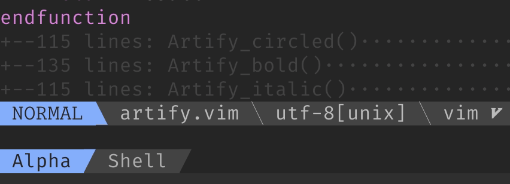
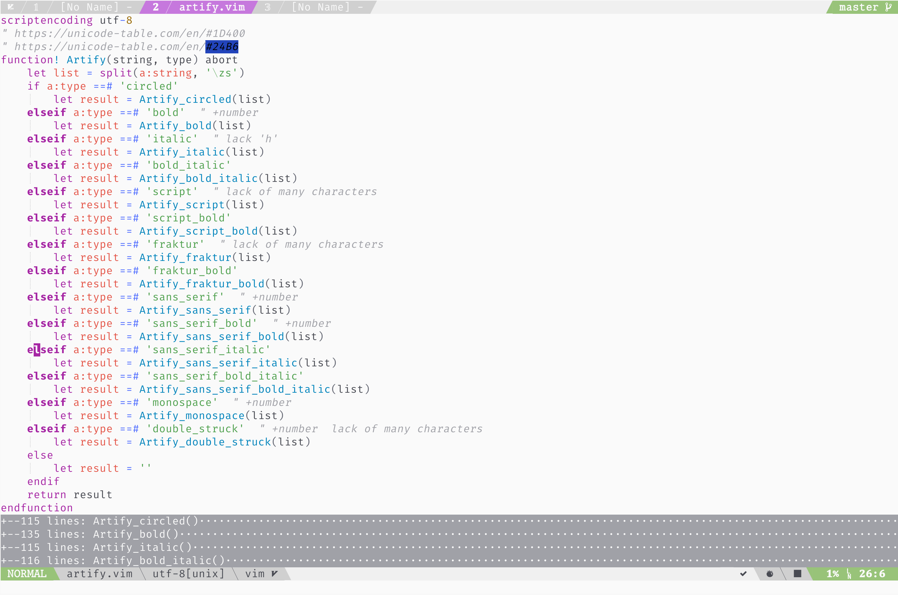

# Introduction

This plugin can change the display of characters **without changing font**.



Thus, you can use it to tweak your vim UI. For example, change the display of tab line and status line.



The principle of this plugin is very simple: convert English characters into special unicodes.

https://unicode-table.com/en/#1D400

https://unicode-table.com/en/#24B6

To be honest, I have another purpose to develop this plugin -- generate nickname and biography conveniently.

For example, my twitter name is "Sainnhepark", and now I can use this plugin to convert this string into "𝓢𝓪𝓲𝓷𝓷𝓱𝓮𝓹𝓪𝓻𝓴". Don't you think this is cooler than plain text? LOL

# Installation

for [vim-plug](https://github.com/junegunn/vim-plug)

```vim
Plug 'sainnhe/artify.vim'
```

# Usage

`:echo Artify('foo', 'script_bold')`

The first parameter is the string you want to convert, and the second parameter is the "artify" type.

All available types are listed blow:

| type                   | 0-9 available? | all a-Z characters available? |
| ---------------------- | -------------- | ----------------------------- |
| circled                | no             | yes                           |
| bold                   | yes            | yes                           |
| italic                 | no             | no                            |
| bold_italic            | no             | yes                           |
| script                 | no             | no                            |
| script_bold            | no             | yes                           |
| fraktur                | no             | no                            |
| fraktur_bold           | no             | yes                           |
| sans_serif             | yes            | yes                           |
| sans_serif_bold        | yes            | yes                           |
| sans_serif_italic      | no             | yes                           |
| sans_serif_bold_italic | no             | yes                           |
| monospace              | yes            | yes                           |
| double_struck          | yes            | no                            |

# Example Configuration

This is the example lightline configuration of the picture above. For more information, check this [gist](https://gist.github.com/sainnhe/b8240bc047313fd6185bb8052df5a8fb).

```vim
function! Articy_active_tab_num(n) abort"{{{
    return Artify(a:n, 'bold')." \ue0bb"
endfunction"}}}
function! Artify_inactive_tab_num(n) abort"{{{
    return Artify(a:n, 'double_struck')." \ue0bb"
endfunction"}}}
function! Artify_lightline_tab_filename(s) abort"{{{
    return Artify(lightline#tab#filename(a:s), 'monospace')
endfunction"}}}
function! Artify_lightline_mode() abort"{{{
    return Artify(lightline#mode(), 'monospace')
endfunction"}}}
function! Artify_line_percent() abort"{{{
    return Artify(string((100*line('.'))/line('$')), 'bold')
endfunction"}}}
function! Artify_line_num() abort"{{{
    return Artify(string(line('.')), 'bold')
endfunction"}}}
function! Artify_col_num() abort"{{{
    return Artify(string(getcurpos()[2]), 'bold')
endfunction"}}}


let g:lightline.tab_component_function = {
            \ 'artify_activetabnum': 'Articy_active_tab_num',
            \ 'artify_inactivetabnum': 'Artify_inactive_tab_num',
            \ 'artify_filename': 'Artify_lightline_tab_filename',
            \ }


let g:lightline.component = {
            \ 'artify_mode': '%{Artify_lightline_mode()}',
            \ 'artify_lineinfo': "%2{Artify_line_percent()}\uf295 %3{Artify_line_num()}:%-2{Artify_col_num()}",
            \ }


let g:lightline.active = {
            \ 'left': [ [ 'artify_mode', 'paste' ],
            \           [ 'readonly', 'filename', 'modified', 'fileformat', 'devicons_filetype' ] ],
            \ 'right': [ [ 'artify_lineinfo' ],
            \            g:Lightline_StatusIndicators + g:Lightline_Linter,
            \           [ 'asyncrun_status' ] ]
            \ }
let g:lightline.inactive = {
            \ 'left': [ [ 'filename' , 'modified', 'fileformat', 'devicons_filetype' ]],
            \ 'right': [ [ 'artify_lineinfo' ] ]
            \ }
let g:lightline.tabline = {
            \ 'left': [ [ 'vim_logo', 'tabs' ] ],
            \ 'right': [ [ 'artify_gitbranch' ],
            \ [ g:Lightline_GitStatus ] ]
            \ }
let g:lightline.tab = {
            \ 'active': [ 'artify_activetabnum', 'artify_filename', 'modified' ],
            \ 'inactive': [ 'artify_inactivetabnum', 'filename', 'modified' ] }
```
